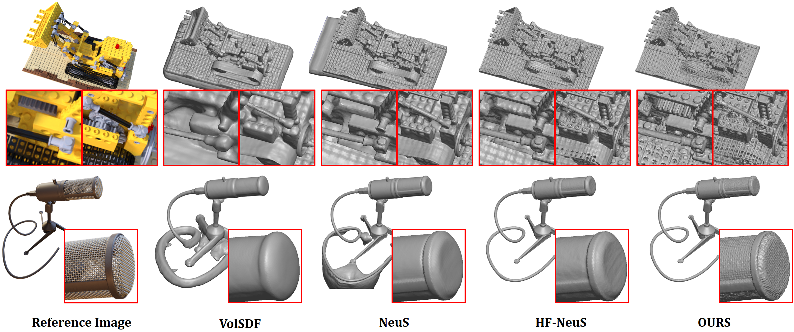
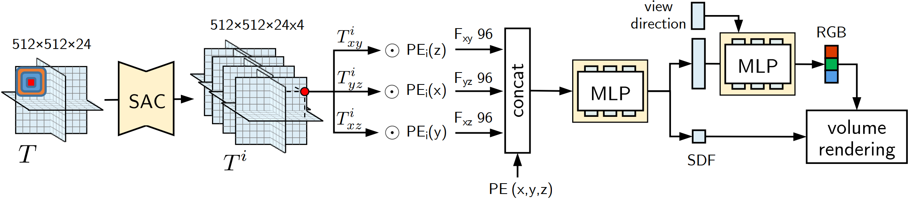
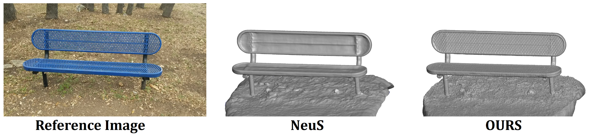

# PET-NeuS: Positional Encoding Tri-Planes for Neural Surfaces

<p align="center">
  
</p>

**PET-NeuS: Positional Encoding Tri-Planes for Neural Surfaces** 

*Yiqun Wang, Ivan Skorokhodov, Peter Wonka*

To appear in CVPR 2023 

**[Paper (arXiv)](https://arxiv.org/submit/4885781/view)**

## Abstract
A signed distance function (SDF) parametrized by an MLP is a common ingredient of neural surface reconstruction. We build on the successful recent method NeuS to extend it by three new components. The first component is to borrow the tri-plane representation from EG3D and represent signed distance fields as a mixture of tri-planes and MLPs instead of representing it with MLPs only. Using tri-planes leads to a more expressive data structure but will also introduce noise in the reconstructed surface. The second component is to use a new type of positional encoding with learnable weights to combat noise in the reconstruction process. We divide the features in the tri-plane into multiple frequency scales and modulate them with sin and cos functions of different frequencies. The third component is to use learnable convolution operations on the tri-plane features using self-attention convolution to produce features with different frequency bands. The experiments show that PET-NeuS achieves high-fidelity surface reconstruction on standard datasets. Following previous work and using the Chamfer metric as the most important way to measure surface reconstruction quality, we are able to improve upon the NeuS baseline by 57\% on Nerf-synthetic (0.84 compared to 1.97) and by 15.5\% on DTU (0.71 compared to 0.84). The qualitative evaluation reveals how our method can better control the interference of high-frequency noise.

<p align="center">
  
</p>

<p align="center">
  
</p>

## Citation
```
@article{wang2023petneus,
  title={PET-NeuS: Positional Encoding Triplanes for Neural Surfaces},
  author={Wang, Yiqun and Skorokhodov, Ivan and Wonka, Peter}
  booktitle={Proceedings of the IEEE/CVF Conference on Computer Vision and Pattern Recognition},
  year={2023}
}
```
